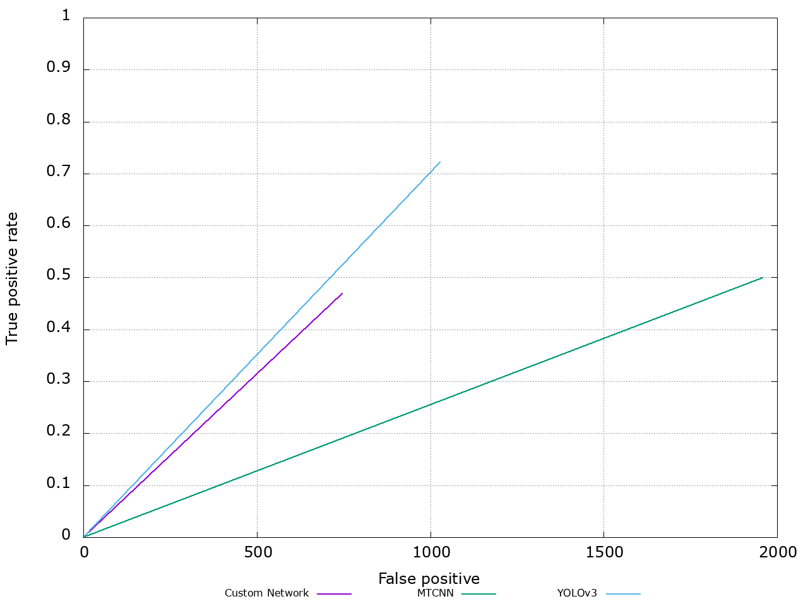
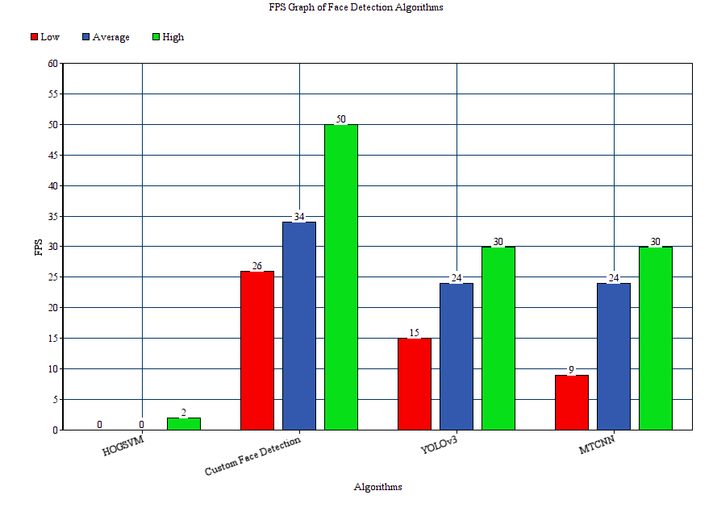

# immanuelfacedetection

This is my master project. It uses a custom neural network trained on INIRA, WIDERFACE and custom face dataset to detect face and to track people in a frame of reference for the robot immanuel from [The Hera Project ]( http://www.hera-project.com/publications/) 

## Results:

Continious ROC for true and false positives of custom NN vs YOLOv3 vs MTCNN  by running evaluation from FDDB

FPS of custom NN vs Yolov3 vs MTCNN for live detection

